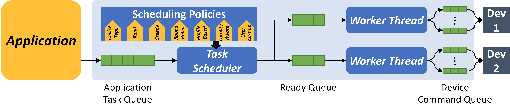
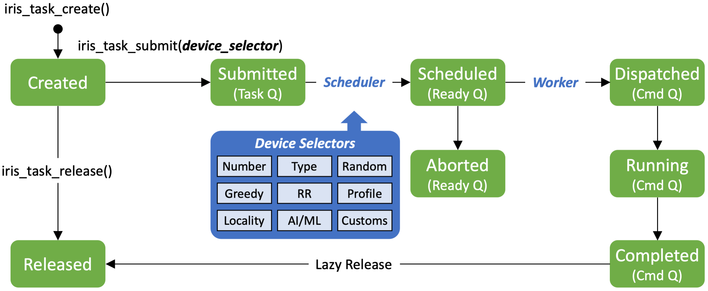

.. index:: ! architecture

.. index:: ! platform model

Platform Model
==================

IRIS's platform model consists of a host connected to one or more compute devices. The host and all compute devices reside in a single-node system. The host can be a multisocket, multicore CPU configuration. A compute device can be a GPU, FPGA, DSP, or even a CPU. A compute device, except for the CPU, communicates with the host and other compute devices via a peripheral interconnect, such as PCIe or NVLink.

.. figure:: _images/overview.png
   :width: 100%
   :align: center

   The IRIS Architecture

.. index:: ! memory model

Memory Model
==================

IRIS's memory model describes the contents and behavior of the memory exposed by the IRIS platform. The memory in IRIS is divided into two parts: host memory and device memory. The host memory is directly available to the host. The device memory is directly available to kernels executing on its attached compute device. The physical device memory can be (1) completely separate from the host memory or (2) shared between the host memory.

To enable flexible :ref:`task <task>` scheduling across multiple compute devices and make programming easier, the IRIS memory model presents the shared virtual device memory for all compute device memories with a *relaxed memory consistency model*, All compute devices can share memory objects in the shared virtual device memory, and they can see the same content in the memory objects using the IRIS synchronization primitives.

.. index:: ! programming model

Programming Model
==================

The IRIS programming model is defined in terms of two distinct units: a host code that executes on the host and kernels that execute on compute devices. To submit kernels to compute devices, the host code creates :ref:`tasks <task>`. IRIS introduces a unified API that abstracts away the differences of programming models from diverse programming systems and offers the :ref:`C <c-api>`, :ref:`C++ <cpp-api>`, :ref:`Fortran <fortran-api>`, and :ref:`Python <python-api>` APIs. Kernels usually contain the most compute-intensive and time-consuming parts of an application, and the overall performance of the application depends on the kernels. Therefore, the kernels must be written and optimized for the target compute device.

.. index:: ! execution model

Execution Model
==================

The application host code submits a task to the application task queue. This task submission includes information about the task, such as a hint, a target device parameter, the synchronization mode (blocking or non-blocking), and a policy selector that indicates on which resource the task should be executed. The application task queue is an out-of-order queue scheduled by the IRIS task scheduler. The task scheduler honors the dependencies among tasks, and synchronization is enforced by the host code. 

.. index:: ! task

.. _task:

Task
==================

IRIS provides task-based programming and execution models. A task is portable across all the available programming platforms and can be run on any accelerator in the system. A task contains zero or more commands. There are three types of commands: (1) host-to-device memory copy command, (2) device-to-host memory copy command, and (3) kernel launch command. The commands in a task are executed in a single compute device in a FIFO execution order. A task can have a dependency on other tasks. When a task depends on other tasks, it cannot start until the prerequisite tasks complete.

   IRIS task lifecycle and state diagram

